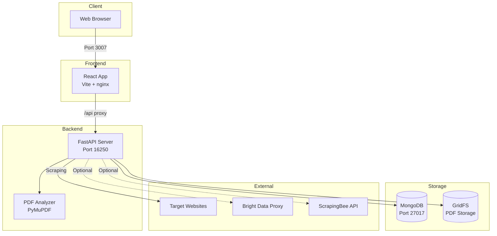
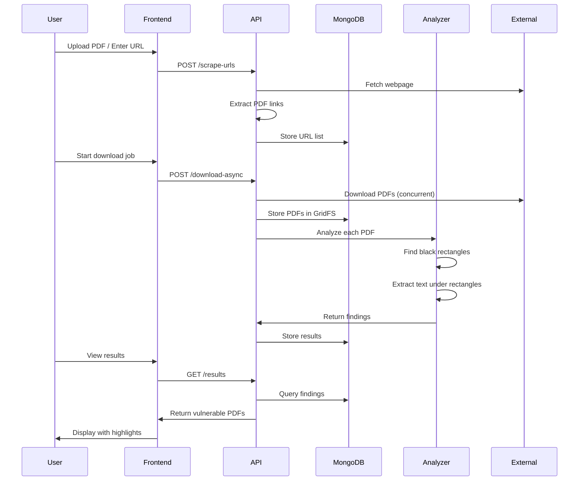
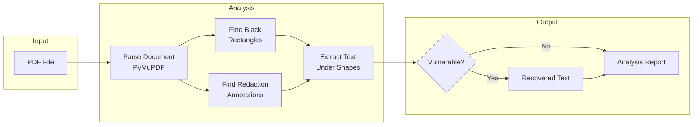
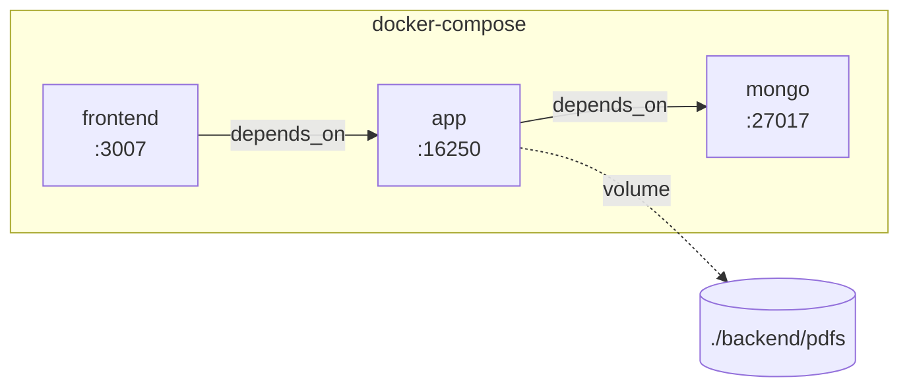

# PDF Redaction Testing Tool

A security testing tool for detecting improperly redacted PDFs. This tool identifies "fake" redactions where text is visually obscured (e.g., black rectangles) but remains extractable from the document structure.

## Features

- **Fake Redaction Detection**: Identifies black rectangles overlaying extractable text
- **Unapplied Redaction Detection**: Finds redaction annotations that weren't properly applied
- **Hidden Text Recovery**: Extracts text from underneath visual redactions
- **Bulk Analysis**: Scrape websites for PDFs and analyze at scale
- **Async Processing**: Concurrent downloads with background analysis
- **Result Persistence**: Store findings in MongoDB with GridFS for PDF storage
- **Web Interface**: React-based UI for managing scrapes, jobs, and viewing results

## Architecture

### System Overview



### Request Flow



### PDF Analysis Pipeline



### Docker Services



## Quick Start

### Prerequisites

- Docker and Docker Compose
- Git

### Setup

1. Clone the repository:
   ```bash
   git clone https://github.com/alexoms/testredact.git
   cd testredact
   ```

2. Create environment file:
   ```bash
   cp .env.sample .env
   # Edit .env with your API keys (optional for basic usage)
   ```

3. Start the services:
   ```bash
   docker-compose up --build
   ```

4. Access the application:
   - **Frontend**: http://localhost:3007
   - **API Docs**: http://localhost:16250/docs

## Configuration

### Environment Variables

| Variable | Description | Required |
|----------|-------------|----------|
| `MONGO_URI` | MongoDB connection string | Yes |
| `SCRAPINGBEE_API_KEY` | ScrapingBee API key for protected sites | No |
| `BRIGHTDATA_CUSTOMER_ID` | Bright Data customer ID | No |
| `BRIGHTDATA_ZONE` | Bright Data zone name | No |
| `BRIGHTDATA_API_KEY` | Bright Data API key | No |

## API Endpoints

### Core Analysis

| Method | Endpoint | Description |
|--------|----------|-------------|
| `POST` | `/analyze` | Analyze a single PDF file |
| `POST` | `/unredact` | Analyze and return unredacted PDF |
| `POST` | `/extract-text` | Extract all text from PDF |
| `POST` | `/analyze-folder` | Analyze all PDFs in a folder |

### Web Scraping

| Method | Endpoint | Description |
|--------|----------|-------------|
| `POST` | `/scrape-urls` | Scrape webpage for PDF links |
| `GET` | `/url-lists` | List stored URL collections |
| `GET` | `/url-lists/{name}` | Get specific URL list |
| `POST` | `/download-async` | Start async download job |

### Job Management

| Method | Endpoint | Description |
|--------|----------|-------------|
| `GET` | `/jobs` | List all async jobs |
| `GET` | `/jobs/{job_id}` | Get job status and progress |

### Results

| Method | Endpoint | Description |
|--------|----------|-------------|
| `GET` | `/results` | Query stored analysis results |
| `GET` | `/uploads` | List uploaded PDFs |
| `GET` | `/uploads/{file_id}` | Retrieve PDF (with optional highlighting) |

## Usage Examples

### Analyze a Single PDF

```bash
curl -X POST "http://localhost:16250/analyze" \
  -F "file=@document.pdf"
```

### Scrape and Analyze Website PDFs

```bash
# Step 1: Scrape PDF links from a webpage
curl -X POST "http://localhost:16250/scrape-urls" \
  -H "Content-Type: application/json" \
  -d '{"url": "https://example.com/documents", "name": "example-docs"}'

# Step 2: Start async download and analysis
curl -X POST "http://localhost:16250/download-async" \
  -H "Content-Type: application/json" \
  -d '{"name": "example-docs", "max_concurrent": 10, "analyze_after": true}'

# Step 3: Check job progress
curl "http://localhost:16250/jobs/{job_id}"

# Step 4: Query vulnerable results
curl "http://localhost:16250/results?vulnerable_only=true"
```

### CLI Usage

```bash
# Analyze single file
python backend/pdf_unredact.py document.pdf

# Analyze with verbose output
python backend/pdf_unredact.py document.pdf -v

# Analyze folder and save log
python backend/pdf_unredact.py --folder ./pdfs --log results.json

# Output as JSON
python backend/pdf_unredact.py document.pdf --json
```

## How It Works

### Detection Methods

1. **Black Rectangle Detection**: Scans PDF drawing operations for filled black rectangles, then extracts any text positioned within those bounds.

2. **Redaction Annotation Check**: Identifies PDF redaction annotations (type 12) and checks if the underlying text was actually removed.

3. **Layer Analysis**: Extracts text using multiple methods (text, rawdict, xhtml, xml) to find content that may be hidden from normal view.

### What Makes a Redaction "Fake"

A properly applied redaction should:
- Remove the underlying text from the document structure
- Replace the area with a visual indicator (black box)
- Remove any metadata about the redacted content

A "fake" redaction only:
- Draws a black rectangle over the text
- Leaves the original text in the document stream
- Can be recovered by parsing the PDF structure

## Project Structure

```
testredact/
├── backend/
│   ├── api.py              # FastAPI REST service
│   ├── pdf_unredact.py     # Core analysis logic
│   ├── requirements.txt    # Python dependencies
│   ├── Dockerfile
│   └── pdfs/               # Downloaded PDFs
├── frontend/
│   ├── src/
│   │   ├── App.jsx         # Main React application
│   │   └── PDFViewer.jsx   # PDF viewer component
│   ├── Dockerfile
│   └── nginx.conf
├── docker-compose.yml
├── .env.sample
└── README.md
```

## Security Considerations

This tool is intended for:
- Security testing of PDF redaction implementations
- Digital forensics and document analysis
- Educational purposes
- CTF challenges

**Do not use this tool to access information you are not authorized to view.**

## License

MIT
